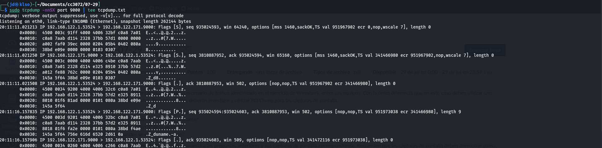
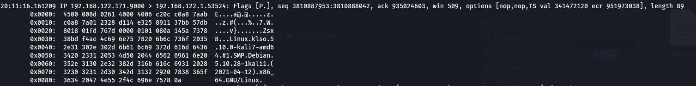

# 2021-07-29 - TCPDump

## Josue Valenzuela 171001

### ¿De qué se trata la captura de tráfico? (i.e. ¿qué está sucediendo?)

Hay una conexión de reverse shell. Se están ejecutando comandos desde una dirección remota.

### ¿Cuál es la dirección IP del equipo atacante? 

192.168.122.53524

### ¿Cuál es la dirección IP de la víctima? 

192.168.122.171

La IP 192.168.122.53524 envía el comando `uname -a` a la IP 192.168.122.171 que luego contesta con la informacion del sistema

### ¿Qué comandos se están ejecutando? 
- `uname -a`
- `iconfig`