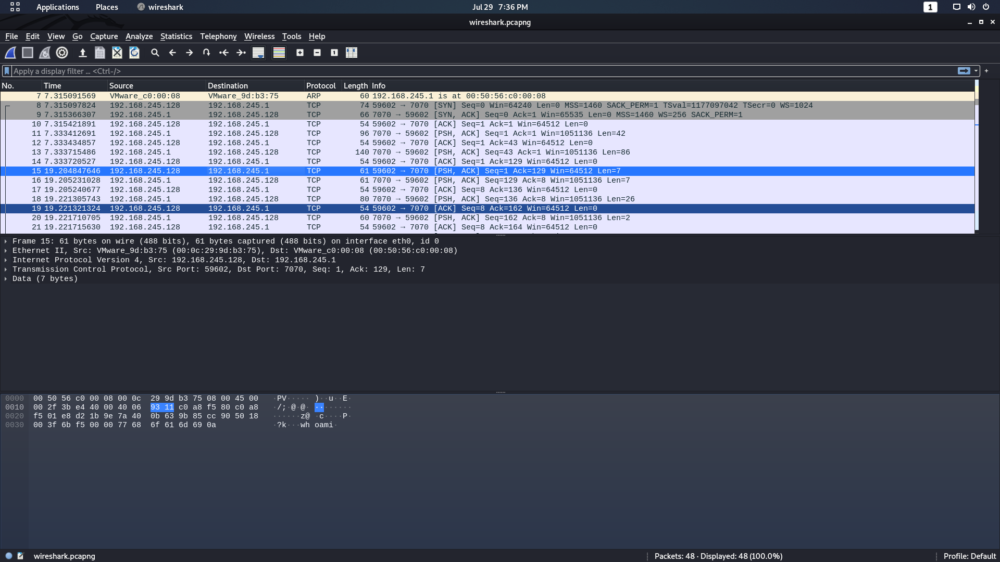
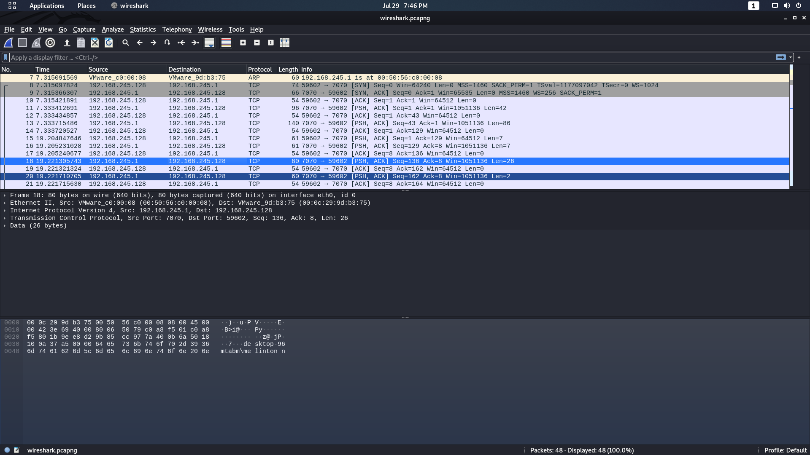

# 2021-07-29 - Wireshark

## Josue Valenzuela 171001

### ¿De qué se trata la captura de tráfico? (i.e. ¿qué está sucediendo?)

Hay una conexión de reverse shell. Se están ejecutando comandos desde una dirección remota.

### ¿Cuál es la dirección IP del equipo atacante? 

192.168.245.128

### ¿Cuál es la dirección IP de la víctima? 

192.168.245.1

La IP 192.168.245.128 envia el comando `whoami` a la IP 192.168.245.1 que luego contesta con el nombre del host

### ¿Qué comandos se están ejecutando? 
- `whoami`
- `ip config`